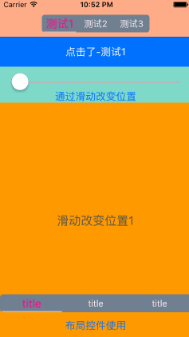

### BTSegmentControl

参考最近很多应用都喜欢做成通过顶部切换视图，所以做了一个类似功能的控件



#### 使用方法

1.引入文件

```
#import "BTSegmentControl.h"
```

2.初始化

```
BTSegmentControl *segment =[[BTSegmentControl alloc]initWithFrame:CGRectMake(0, 200, 180, 30)AndTitleArray:@[@"测试1",@"测试2",@"测试3"]];
segment.delegate=self;
self.navigationItem.titleView=segment;
```
3.必要属性

```
//因为控件多用于滑动或者点击切换视图
//情况一:结合其他滑动控件 isUseForScrollView设为YES。
//情况二:单独使用可以不配置。
//默认值:NO
self.segment.isUseForScrollView=YES;

```
4.非必要属性

```
//整体背景颜色
segment.totalViewBackgroundColor =[UIColor yellowColor];
//按钮默认字体颜色
segment.normalBtnTextColor = [UIColor blueColor];
//按钮点击字体颜色
segment.selectBtnTextColor =[UIColor blackColor];
//按钮点击视图背景颜色
segment.selectBtnViewBackgroundColor=[UIColor purpleColor];
```
5.主要方法

```
//初始化方法
- (instancetype)initWithFrame:(CGRect)frame AndTitleArray:(NSArray *)titleArray;
//手动切换按钮方法
- (void)setSelectedWithIndex:(NSInteger)index;
//滑动更新控件视图
//(注意:该方法一旦被调用则代表通过滑动控件控制控件，isUseForScrollView会自动设置为YES）
- (void)scrollSelectBtnViewWithXPosition:(CGFloat)xPosition MinX:(CGFloat)minX AndMaxX:(CGFloat)maxX;
```
6.代理方法

```
//按钮被点击后的回调方法
- (void)segmentControl:(BTSegmentControl *)segment didSelectedWithIndex:(NSInteger)index;

```